# 0003springboot网页时装购物系统
[](https://player.bilibili.com/player.html?isOutside=true&aid=112751464745317&bvid=BV1GohfeZEqp&cid=500001609163750&p=1)


```
摘  要
随着科学技术的飞速发展，社会的方方面面、各行各业都在努力与现代的先进技术接轨，通过科技手段来提高自身的优势，时装购物系统当然也不能排除在外。时装购物系统是以实际运用为开发背景，运用软件工程原理和开发方法，采用springboot框架构建的一个管理系统。整个开发过程首先对软件系统进行需求分析，得出系统的主要功能。接着对系统进行总体设计和详细设计。总体设计主要包括系统功能设计、系统总体结构设计、系统数据结构设计和系统安全设计等；详细设计主要包括系统数据库访问的实现，主要功能模块的具体实现，模块实现关键代码等。最后对系统进行功能测试，并对测试结果进行分析总结，得出系统中存在的不足及需要改进的地方，为以后的系统维护提供了方便，同时也为今后开发类似系统提供了借鉴和帮助。这种个性化的网上管理系统特别注重交互协调与管理的相互配合，激发了管理人员的创造性与主动性，对时装购物系统而言非常有利。
本时装购物系统采用的数据库是Mysql，使用springboot框架开发。在设计过程中，充分保证了系统代码的良好可读性、实用性、易扩展性、通用性、便于后期维护、操作方便以及页面简洁等特点。

关键词：时装购物系统，springboot框架 Mysql数据库 Java技术
ABSTRACT

With the rapid development of science and technology, all aspects of society, all walks of life are trying to integrate with modern advanced technology, through scientific and technological means to improve their own advantages, fashion shopping system of course can not be excluded. Fashion shopping system is a management system which is based on the practical application, using software engineering principles and development methods, and using springboot framework. In the whole development process, we first analyze the requirements of the software system and get the main functions of the system. Then the overall design and detailed design of the system. The overall design mainly includes system function design, system overall structure design, system data structure design and system security design; the detailed design mainly includes the realization of system database access, the specific realization of main function modules, the key code of module implementation, etc. Finally, the function of the system is tested, and the test results are analyzed and summarized. The deficiencies and the need for improvement in the system are obtained, which provides convenience for the future system maintenance, and also provides reference and help for the future development of similar systems. This personalized online management system pays special attention to the interaction and coordination of management, stimulates the creativity and initiative of managers, and is very beneficial to fashion shopping system.
The database of this fashion shopping system is mysql, which is developed with springboot framework. In the design process, it fully ensures the good readability, practicability, expansibility, universality, easy to maintain, easy to operate and concise page of the system code.
Key words: fashion shopping system, springboot framework, MySQL database, Java technology
目 录
摘  要	I
ABSTRACT	II
目 录	II
第1章 绪论	1
1.1背景及意义	1
1.2 国内外研究概况	1
1.3 研究的内容	1
第2章 相关技术	3
2.1 B/S架构	4
2.2 Java技术介绍	6
2.3 mysql数据库介绍	6
2.4 springboot框架	4
第3章 系统分析	5
3.1 需求分析	5
3.2 系统可行性分析	5
3.2.1技术可行性：技术背景	5
3.2.2经济可行性	6
3.2.3操作可行性：	6
3.3 项目设计目标与原则	6
3.4系统流程分析	7
3.4.1操作流程	7
3.4.2添加信息流程	8
3.4.3删除信息流程	9
第4章 系统设计	11
4.1 系统体系结构	11
4.2开发流程设计系统	12
4.3 数据库设计原则	13
4.4 数据表	15
第5章 系统详细设计	19
5.1管理员功能模块	20
5.2用户功能模块	23
5.3前台首页功能模块	19
第6章  系统测试	25
6.1系统测试的目的	25
6.2系统测试方法	25
6.3功能测试	26
结  论	28
致  谢	29
参考文献	30
第1章 绪论
1.1背景及意义
随着社会的快速发展，计算机的影响是全面且深入的。人们生活水平的不断提高，日常生活中人们对时装购物系统方面的要求也在不断提高，喜欢购物的人数更是不断增加，使得时装购物系统的开发成为必需而且紧迫的事情。时装购物系统主要是借助计算机，通过对时装购物系统所需的信息管理，增加用户的选择，同时也方便对广大时装购物系统的及时查询、修改以及对时装购物系统的及时了解。时装购物系统对用户带来了更多的便利，该系统通过和数据库管理系统软件协作来满足用户的需求。计算机技术在现代管理中的应用，使计算机成为人们应用现代技术的重要工具。能够有效的解决获取信息便捷化、全面化的问题，提高效率。
本时装购物系统主要牵扯到程序，数据库与计算机技术等。覆盖知识面大，可以大大的提高系统人员工作效率。
1.2 国内外研究概况
随着国内经济形势的不断发展，中国互联网进入了一个难得的高峰发展时期，这使得中外资本家纷纷转向互联网市场。然而，许多管理领域的不合理结构，人员不足以及管理需求的增加使得更多的人具备了互联网管理的意识。
在当今高度发达的信息中，信息管理改革已成为一种更加广泛和全面的趋势。“时装购物系统”是基于Mysql数据库，在springboot框架程序设计的基础上实现的。为确保中国经济的持续发展，信息时代日益更新，更是蓬勃发展。同时，随着信息社会的快速发展，时装购物系统面临着越来越多的信息，因此很难获得他们对高效信息的需求，如何使用方便快捷的方式使查询者在广阔的时装购物系统信息中查询，存储，管理和共享信息方面有效，对我们的学习，工作和生活具有重要的现实意义。因此，国内外学术界对此进行了深入而广泛的研究，一个新的研究领域——时装购物系统诞生了。
1.3 研究的内容
目前许多人仍将传统的纸质工具作为信息管理的主要工具，而网络技术的应用只是起到辅助作用。在对网络工具的认知程度上，较为传统的office软件等仍是人们使用的主要工具，而相对全面且专业的时装购物系统的信息管理软件仍没有得到大多数人的了解或认可。本选题则旨在通过标签分类管理等方式，实现管理员：首页、个人中心、用户管理、商品分类管理、颜色管理、商品信息管理、商品评价管理、系统管理、订单管理，用户；首页、个人中心、商品评价管理、我的收藏管理、订单管理，前台首页；首页、商品信息、商品资讯、个人中心、后台管理、购物车、客服等功能。从而达到对时装购物系统信息的高效管理。 
    第2章 相关技术
2.1  B/S架构 
B/S结构的特点也非常多，例如在很多浏览器中都可以做出信号请求。并且可以适当的减轻用户的工作量，通过对客户端安装或者是配置少量的运行软件就能够逐步减少用户的工作量，这些功能的操作主要是由服务器来进行控制的，由于该软件的技术不断成熟，最主要的特点就是与浏览器相互配合为软件开发带来了极大的便利，不仅能够减少开发成本，还能够不断加强系统的软件功能，层层相互独立和展现层是该B/S结构完成相互连接的主要特性。
2.2  Java技术介绍 
Java语言擅长开发互联网类应用和企业级应用，现在已经相当的成熟，而且也是目前使用最多的编程语言之一。Java语言具有很好的面向对象性，可以符合人的思维模式进行设计，封装是将对象的属性和方法尽可能地隐藏起来，使得外界并不知道是如何实现的，外界能通过接口进行访问，继承是指每个类都会有一个父类，所有的子类都有父类的方法，可以进行继承，但是只有final修饰的类不能被继承，通过继承可以使得代码得到重新利用，能够提高软件的开发效率，也是多态的前提。
Java就像C语言、C#语言等，也是一种程序开发语言，而它的特点就是面向对象。作为一种程序开发与设计的语言，它有很多特性，主要特性就是面向对象、夸平台以及可以分布式运行。Java语言项目不但安全性高、稳定性强，而且可以并发运行。
为了提高开发的速度及效率，必须做到代码的重复使用和简化程序的复杂度，要达到上述的要求java语言通过封装、继承与多态等方式实现，这样可以很大程度上达到信息的封装，提高代码复用率，减少冗余度，提高效率。它使得以往程序中大量存在的内存泄漏的问题得到了较好的缓解。所谓的内存泄漏就是程序向操作系统申请了一块存储空间，比如定义了一个变量，但是由于某种原因，这个变量一直没有使用，但是仍然占用着系统的内存空间，可能一两个这样的变量对程序和操作系统造不成什么大的影响，但是试想如果这样的变量定义的多了系统的内存空间就会一步步减少，从而造成机器的性能降低甚至宕机。但是在Java中有垃圾回收机制的存在，这种机制极大地避免了内存泄漏的出现，在Java虚拟机中，垃圾回收机制会对长时间没有引用变量指向的对象实施垃圾回收，简单的说就是将这个对象销毁，以避免内存泄漏的情况出现。
 2.3 mysql数据库介绍 
MySQL是一款Relational Database Management System，直译过来的意思就是关系型
```


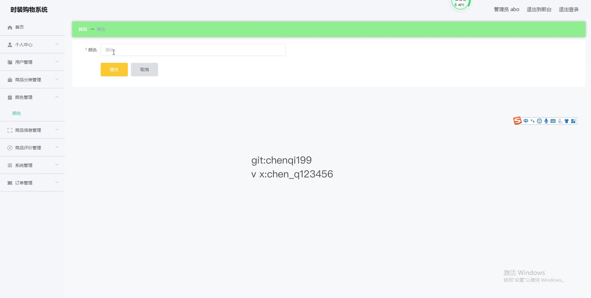

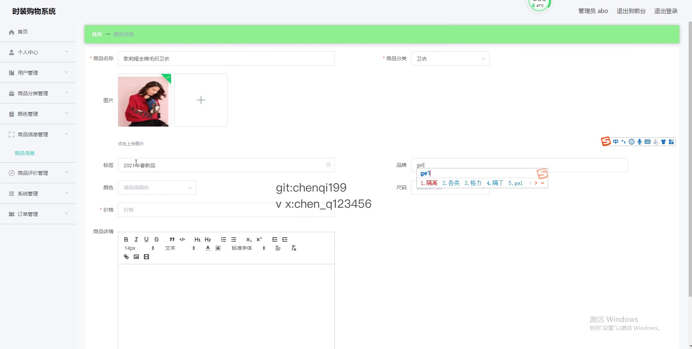
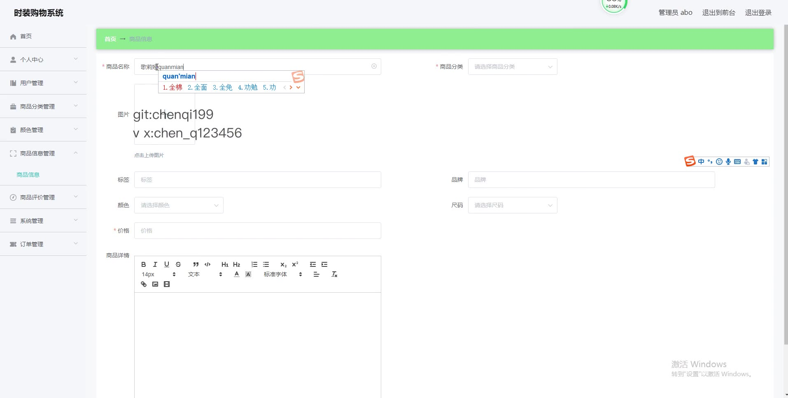
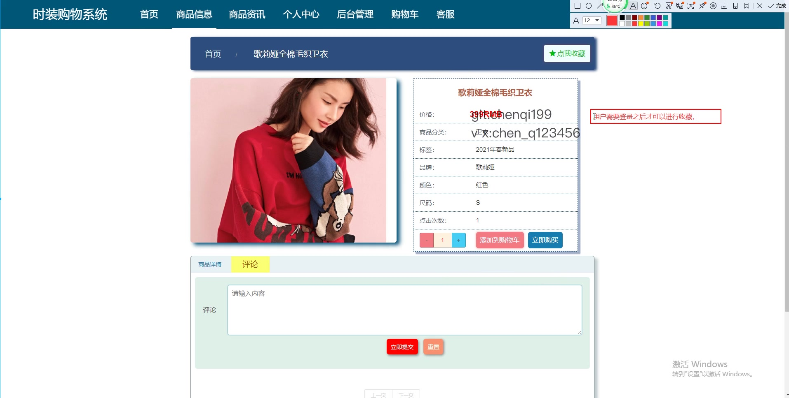

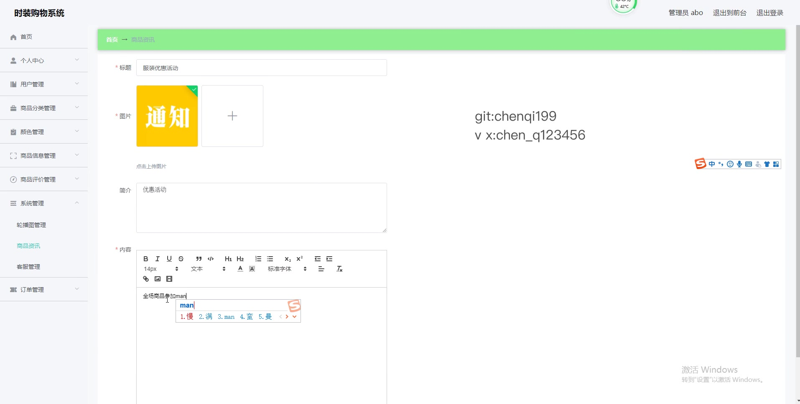
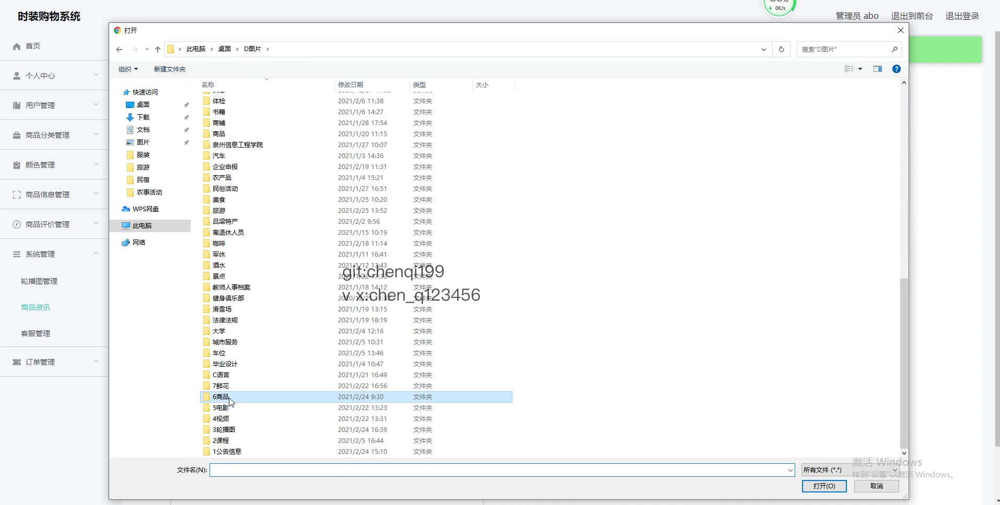

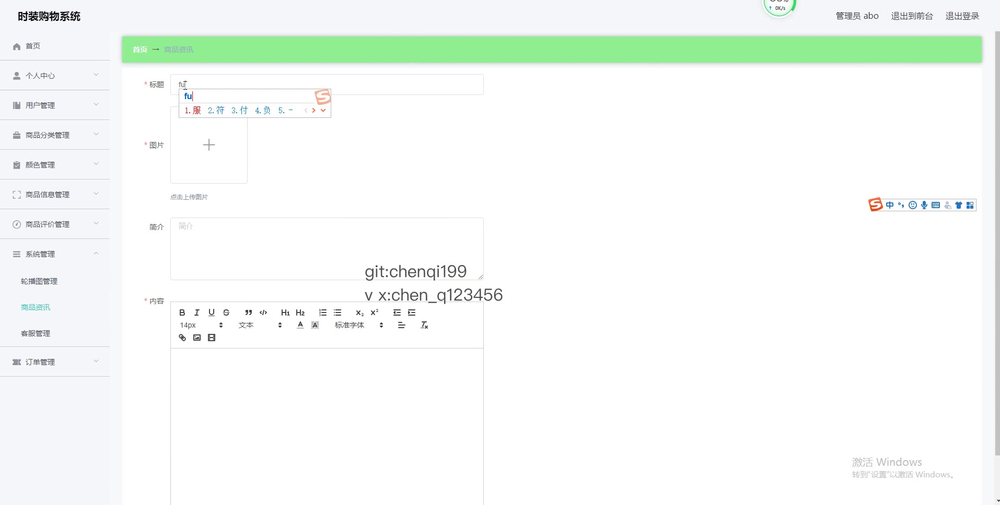


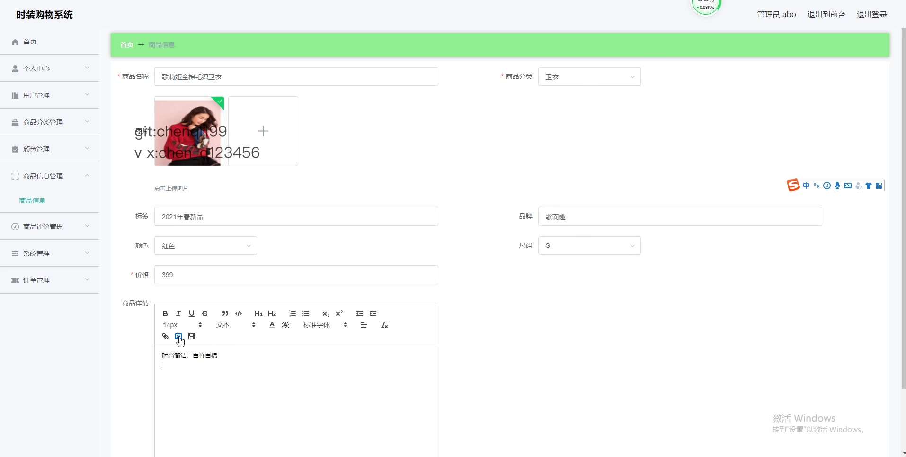

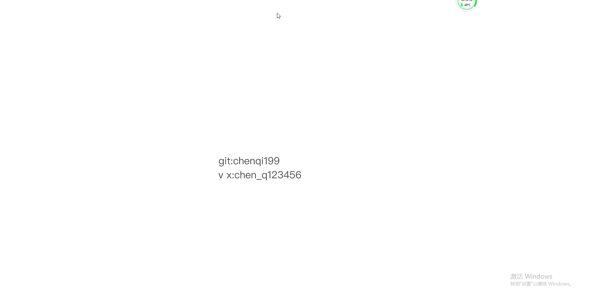
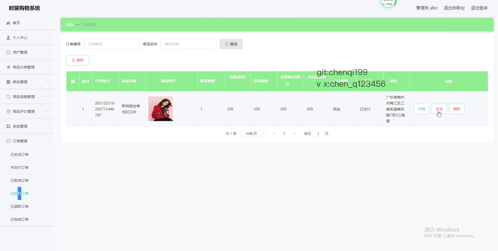
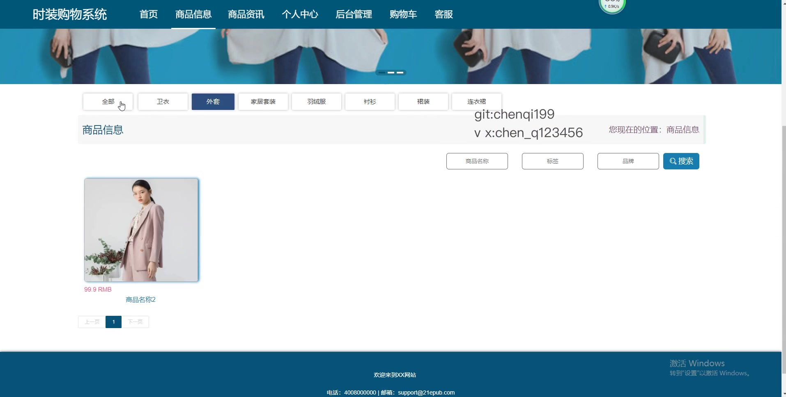


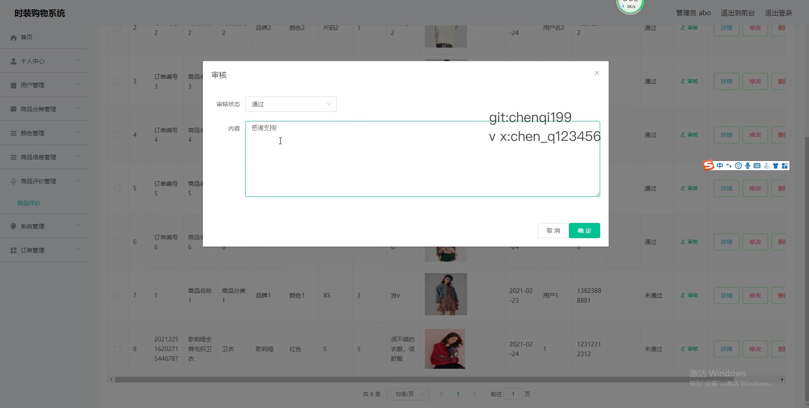


